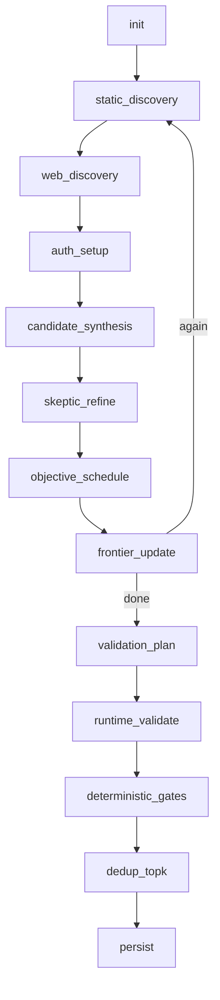

# padv Flow, Arbeitsweise und Design

## 1) Zielbild und Scope
`padv` ist ein lokales CLI-Tool fuer Discovery, Detection und deterministische Validation von PHP-Sicherheitskandidaten.

Kernziel:
- Kandidaten intelligent sammeln (statisch + webnah)
- Validation reproduzierbar und mechanisch entscheiden
- False Positives durch harte Gates reduzieren

Explizite Grenzen:
- Keine Advisory/Issue-Generierung
- Keine Auto-Patching-/PR-Automation
- Keine externen Targets; nur Sandbox-/lokale Zielsysteme
- Kein "exploit engineering" als Produktziel

## 2) Leitprinzipien der Architektur
1. Agenten planen, Gates entscheiden.
2. Runtime-Wahrheit kommt aus dem Morcilla Header-Oracle.
3. Evidence-first statt textueller Bewertung.
4. Reproduzierbarkeit vor Coverage-Maximierung.
5. Konfiguration ist strikt und auf sichere Defaults ausgerichtet.

## 3) High-Level Komponenten
- CLI-Schicht: Kommandos fuer Run/Analyze/Validate/Sandbox/Store-Inspection.
- Orchestrator (LangGraph): Fuehrt den End-to-End-Flow als determinierte Stages und Iterationsschleifen aus.
- Discovery-Stack:
  - Source-Discovery (dateibasierte Sink-Hinweise)
  - Joern-Discovery (CPG-basierte Treffer)
  - SCIP-Discovery (symbolbasierte Treffer)
  - Web-Discovery (Playwright + LLM-gestuetzte Navigation/Param-Hints)
- Agent-Harness (DeepAgents): Ranking, Skepsis, Scheduling, Validation-Planung.
- Runtime-Validation: HTTP-Requests mit Morcilla-Instrumentierung und Canary-Strategie.
- Gate Engine: Deterministische Entscheidung `VALIDATED | DROPPED | NEEDS_HUMAN_SETUP`.
- Evidence Store: Persistiert Kandidaten, Bundles, Runs, Frontier und Stage-Snapshots.

## 4) End-to-End Arbeitsweise

### 4.1 Kommandos und Produktmodus
- `padv analyze`: Discovery + Synthesis, ohne Runtime-Validation.
- `padv run`: Voller Ablauf inkl. Validation und Gate-Entscheidung.
- `padv validate`: Validiert vorhandene oder neu selektierte Kandidaten gezielt (validate-only Modus).
- `padv sandbox`: Operative Hilfsaktionen (`deploy/reset/status/logs`).
- `padv list/show/export`: Zugriff auf persistierte Artefakte.

### 4.2 Orchestrierter Stage-Flow

Hinweise:
- `analyze` endet bei `persist` ohne Validation-Zweig.
- `validate` startet als `validate-only`: Discovery wird uebersprungen, Validation laeuft direkt auf selektierten Kandidaten.
- Pro Stage werden Snapshots in den Run-Artefakten abgelegt.

## 5) Discovery und Kandidatenaufbau

### 5.1 Statische Discovery-Kanaele
- Source-Discovery liefert schnelle, robuste Basis-Hinweise aus PHP-Dateien.
- Joern liefert semantisch staerkere Call-/Sink-Signale.
- SCIP ergaenzt symbolische Sicht und erzeugt eigene Evidence-Referenzen.

Fusion-Design:
- Kandidaten aus allen Kanaelen werden ueber eine gemeinsame Schluesselstruktur zusammengefuehrt.
- Provenance, Intercepts, Preconditions und Hinweise werden dedupliziert zusammengelegt.
- Candidate IDs werden nach Fusion neu und stabilisiert vergeben (`cand-xxxxx`).

### 5.2 Web-Discovery
- Browser-basierte Navigation extrahiert interne Pfade und Parameter.
- LLM priorisiert naechste URL-Schritte fuer Informationsgewinn.
- Ergebnisse fliessen als `web_path_hints` in Kandidaten.
- Fehler im Web-Discovery-Pfad werden als harte Laufzeitfehler behandelt (strict mode).

### 5.3 Auth-Setup
- Optionaler Login-Flow via Playwright erzeugt Session-Cookies.
- Geloeste Auth-States entfernen `auth-state-known` als offene Precondition.
- Auth-Zustand wird redaktiert als eigenes Artefakt persistiert.

## 6) Agentische Faehigkeiten (funktional)
DeepAgents werden fuer vier Aufgaben eingesetzt:
- Proposer-Ranking: Reihenfolge nach erwarteter Informationsausbeute.
- Skeptic-Refinement: Schwache Kandidaten verwerfen, Unsicherheiten sichtbar machen.
- Scheduler: Auswahl der naechsten Validationsaktionen im Budget.
- Planer: Erzeugt pro Kandidat einen deterministischen HTTP-Validationsplan.

Wichtiges Designmerkmal:
- Agenten liefern JSON-Outputs als Planungsinput.
- Endgueltige Entscheidung liegt nie beim LLM, sondern immer bei der Gate Engine.

## 7) Runtime Validation und deterministische Gates

### 7.1 Validation-Plan
Pro Kandidat entsteht ein Plan mit:
- Intercept-Set
- exakt 3 positive Requests
- mindestens 1 negativer Kontroll-Request
- eindeutigem Canary

### 7.2 Ausfuehrung
- Requests tragen Morcilla-Request-Header (Key, Intercepts, Correlation).
- Response-Header liefern Runtime-Report (Status, Call-Count, Payload, Truncation/Overflow-Flags).
- Je nach Klasse werden zusaetzliche HTTP-Signale ausgewertet (z. B. reflected canary, authz pairs, debug leak flags).
- Budgets begrenzen Gesamtrequests, Laufzeit pro Run und pro Kandidat.
- Optionales Sandbox-Reset stabilisiert Reproduzierbarkeit.

### 7.3 Gate-System (V0-V6)
- V0 Scope/Safety: Runtime muss valide und instrumentiert sein.
- V1 Preconditions: offene Preconditions fuehren zu `NEEDS_HUMAN_SETUP`.
- V2 Multi-Evidence: statische + runtime-nahe Signale muessen konsistent sein.
- V3 Boundary/Signal Proof: Canary- oder klassenspezifischer Runtime-Nachweis.
- V4 Negative Controls: Negativlauf darf keinen gleichwertigen Treffer liefern.
- V5 Reproduktion/Integritaet: ausreichende Wiederholungen, keine Truncation/Overflow.
- V6 Abschluss: nur dann `VALIDATED`.

## 8) Morcilla-Integration (inkl. `../morcilla`)

### 8.1 Integrationsrolle
Morcilla ist das Runtime-Oracle zwischen HTTP-Request und PHP-Ausfuehrung:
- Aktivierung/Steuerung per Request-Header
- Beobachtung per Response-Header
- Grundlage fuer deterministische Reachability/Influence-Pruefung

### 8.2 Header-Contract
Request-seitig:
- API-Key Header
- Intercept-Set Header
- Correlation Header

Response-seitig:
- Status
- Call-Count
- Result-Payload (`json` oder `base64-json`)
- Overflow-/Truncation-Indikatoren
- Correlation-Echo

Bewertung:
- Truncation oder Overflow invalidieren die Reproduktionsqualitaet (Gate-Fail in V5).
- Fehlende/inaktive Instrumentierung fuehrt zu Scope-Fail (V0).

### 8.3 Praktische `../morcilla`-Einbindung
Typische lokale Muster:
- Host-Target-Mount als `targets/` und Symlink `targets/morcilla -> ../morcilla`.
- Alternativ Docker-Compose mit `PADV_TARGETS_DIR=../morcilla`, dann Analyse unter `/workspace/targets`.
- Fuer phpMyFAQ-E2E wird Morcilla als PHP-Extension in den Apache-Container gebaut und vor Testlauf geprueft.

Damit bleibt die Instrumentierung reproduzierbar, lokal und sandbox-konform.

## 9) Persistenz und Nachvollziehbarkeit
Standardstore (z. B. `.padv`) enthaelt:
- `candidates.json`
- `static_evidence.json`
- `bundles/*.json`
- `runs/*.json`
- `frontier_state.json`
- `runs/<run-id>/stages/*.json`
- `artifacts/` (z. B. Web-Discovery/Auth-State)

Designnutzen:
- Jeder Lauf ist auditierbar.
- Entscheidungen sind an konkrete Evidence gebunden.
- Frontier-Iteration erlaubt kontrolliertes Lernen ueber mehrere Runs.

## 10) Designgrenzen und Erweiterungspunkte

Stabile Grenzen:
- Deterministische Gate-Entscheidung als Pflichtkern.
- Morcilla-Contract als Runtime-Quelle.
- Keine externen Scan-Targets.

Natuerliche Erweiterungspunkte:
- Neue Discovery-Signale mit gleichbleibendem Evidence-Schema.
- Zuschnitt von Intercept-Sets pro Klasse/Target.
- Bessere Auth-Profile und State-Recipes.
- Zusaetzliche Dedup-/Priorisierungsstrategien, solange Gate-Determinismus erhalten bleibt.

## 11) Betriebszusammenfassung
`padv` kombiniert agentische Exploration mit strikter, reproduzierbarer Runtime-Validierung. Die eigentliche Sicherheitsentscheidung wird nicht "generiert", sondern aus static + runtime evidence mechanisch abgeleitet. Die `../morcilla`-Integration ist dabei der zentrale Hebel fuer belastbare, wiederholbare Validation in lokalen Sandbox-Umgebungen.
